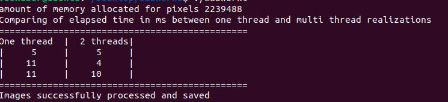
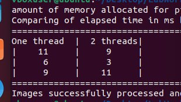

## Report: parallel processing of BMP images

## Experiment methodology

Reproducible experiments were conducted to compare performance. In each run, the execution time of image processing was measured using one and two threads.

The amount of allocated memory for pixels: **2,239,488 bytes**.

### Measurement results:

#### First run:

| One thread | 2 threads |
|------------|-----------|
|     5 ms   |    5 ms   |
|    11 ms   |    4 ms   |
|    11 ms   |   10 ms   |

#### Second run:

| One thread | 2 threads |
|------------|-----------|
|    11 ms   |    9 ms   |
|     6 ms   |    3 ms   |
|     9 ms   |   11 ms   |

**Conclusion**: multithreaded implementation shows improvement in processing time in most cases.

## Peculiarities of testing in VirtualBox

The experiments were conducted in the **VirtualBox** environment. This may have affected the accuracy and stability of the timing measurements for the following reasons:

- The virtual machine often uses a **limited number of virtual cores** that do not match the number of physical processors on the host machine.
- Thread management and scheduling in a virtualized environment may be **less efficient** than on a real machine.
- **Hardware resources** may be shared between the virtual machine and other host processes, reducing the performance of multithreaded tasks.
- There may be **additional overhead** for synchronization and thread context switching within the virtual environment.

**Conclusion**: running a multithreaded implementation in VirtualBox may not reflect the real performance of code on a physical machine. To accurately estimate efficiency, it is recommended to run the program on a real system without virtualization.
